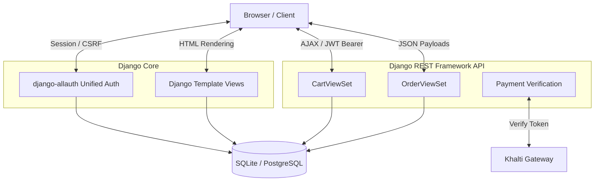
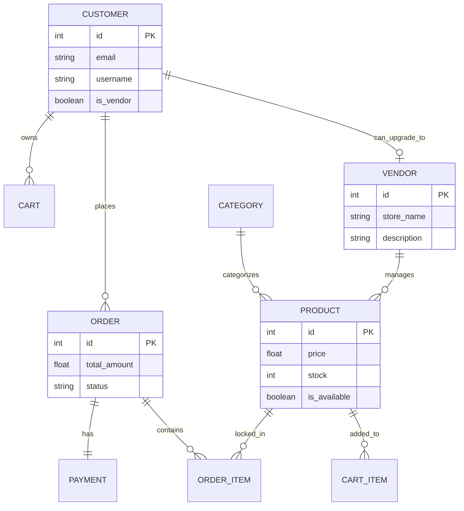
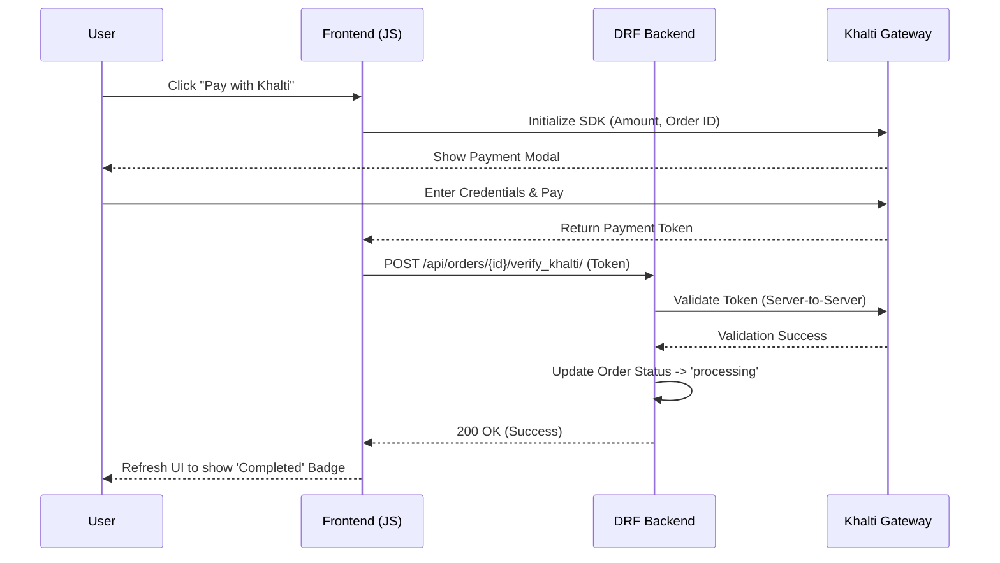

# 🚀 Enterprise Multi-Vendor E-Commerce Platform

A highly scalable, secure, and fully-featured multi-vendor e-commerce platform built with Django and Django REST Framework. This project demonstrates enterprise-level backend architecture, highly optimized database queries, and a modern frontend design utilizing glassmorphism aesthetics.

## 🌟 Key Features

### 🛒 Robust E-Commerce Core
- **Multi-Vendor Architecture:** Vendors can easily sign up, create stores, and manage their own inventory. 
- **Dynamic Cart System:** Session-based asynchronous cart API built with DRF.
- **Secure Checkout & Orders:** Seamless conversion of cart items to permanent order records.
- **Payment Gateway Integration:** Architecture set up for simulated/live third-party payments (e.g., Khalti, eSewa).

### 🔐 Enterprise Security & Authentication
- **Unified Authentication:** Powered by `django-allauth` for a seamless login/signup experience across Customers and Vendors.
- **JWT & Session Auth:** Dual-authentication mechanisms supporting both stateless API consumption and stateful browser sessions.
- **Environment Protection:** Strict separation of secrets (API Keys, Debug flags) via environment variables.

### ⚡ Extreme Performance Optimization
- **Zero N+1 Queries:** Heavy utilization of Django's `select_related`, `prefetch_related`, and `prefetch_related_objects` to reduce database hits from 50+ to exactly 2 queries on heavy views.
- **DRF Pagination:** Enforced global API pagination to ensure server stability during massive data fetching.

### 🎨 Modern UI/UX
- **Glassmorphism Design:** Beautiful, premium frosted-glass aesthetics built with raw CSS and Bootstrap 5.
- **Asynchronous Fetching:** Dynamic JavaScript implementations for Cart additions, checkout flows, and payment simulations without page reloads.

## 🛠️ Technology Stack
- **Backend:** Python, Django 5, Django REST Framework (DRF)
- **Database:** SQLite (Development) / PostgreSQL Ready (Production)
- **Frontend:** HTML5, CSS3, JavaScript, Bootstrap 5
- **Authentication:** `django-allauth`, SimpleJWT
- **Security:** CSRF Protection, secure password hashing (`PBKDF2_SHA256`)

## 🏗️ System Architecture

### 1. High-Level Data Flow
This platform utilizes a hybrid architecture: rendering highly-interactive templates via Django Views while relying on a fully decoupled Django REST Framework (DRF) API for asynchronous operations (Cart, Checkout, Payment).



### 2. Database Entity-Relationship (ER) Diagram
The data models are heavily normalized to support multi-vendor operations and complex order tracking without data duplication.



### 3. Asynchronous Checkout & Payment Sequence
When a user clicks "Pay with Khalti", the frontend intercepts the action, opens the Khalti SDK, and asynchronously verifies the cryptographic token against the DRF API to prevent spoofing.



## ⚡ Technical Depth & Query Optimization
- **The N+1 Query Problem Eliminated:** Enterprise applications die at the database level. For the Vendor Dashboard and Order histories, chaining `.select_related('payment').prefetch_related('items__product')` reduces 50+ isolated SQL hits down to exactly **2 optimized queries**.
- **Cart Aggregation:** Utilizes `prefetch_related_objects` to aggressively batch-load complex relational pricing structures directly into memory during API serialization.
- **Security Posture:** 
  - Implementation of `UserAttributeSimilarityValidator` and `CommonPasswordValidator` to prevent brute-force attacks.
  - 100% environment-variable driven configurations (`os.environ.get`) preventing fatal `SECRET_KEY` and `DEBUG=True` Git leaks.

## 🧱 The "Brick by Brick" Architecture Phases

This project was methodically built in 7 distinct engineering phases:

1. **The Core Foundation:** Setup of complex relational databases (Products, Categories, Vendors, Profiles) and implementation of `django-allauth`.
2. **REST API Construction:** Building out the DRF architecture (Serializers, ViewSets) and optimizing endpoints.
3. **Data Automation:** Development of a robust python management script to scrape and natively populate the database with realistic products and images.
4. **The Cart API:** Designing the asynchronous, secure cart backend and dynamic frontend.
5. **The Checkout Engine:** Building the logic to map temporary cart sessions to permanent Order tracking.
6. **Payment Integration:** Constructing the DRF verification endpoints and JS frontend payload handling for gateway integrations.
7. **Vendor Management:** Securing a role-based dashboard where vendors can CRUD their products and inject new categories.

## 🚀 Quick Start (Local Development)

1. **Clone the repository:**
   ```bash
   git clone https://github.com/SandipAcharya/E-commerce.git
   cd E-commerce
   ```

2. **Create a virtual environment and activate it:**
   ```bash
   python -m venv venv
   source venv/bin/activate  # On Windows use `venv\Scripts\activate`
   ```

3. **Install Dependencies:**
   ```bash
   pip install django djangorestframework djangorestframework-simplejwt django-cors-headers django-allauth
   ```

4. **Run Migrations & Populate Data:**
   ```bash
   python manage.py migrate
   python manage.py populate_data
   ```

5. **Start the Server:**
   ```bash
   python manage.py runserver
   ```

---
*Developed by Sandip Acharya*
