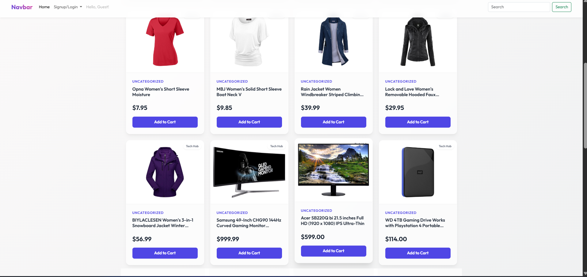
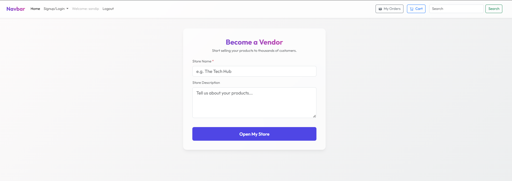
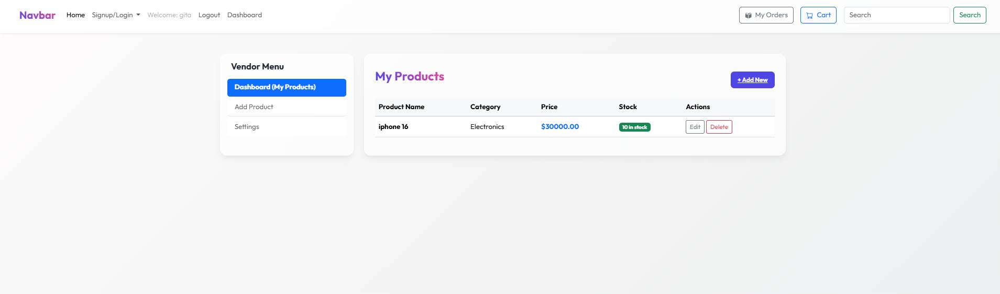
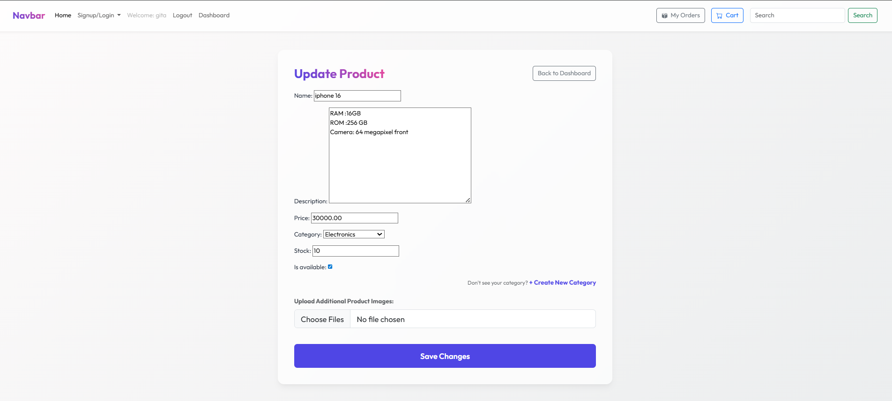
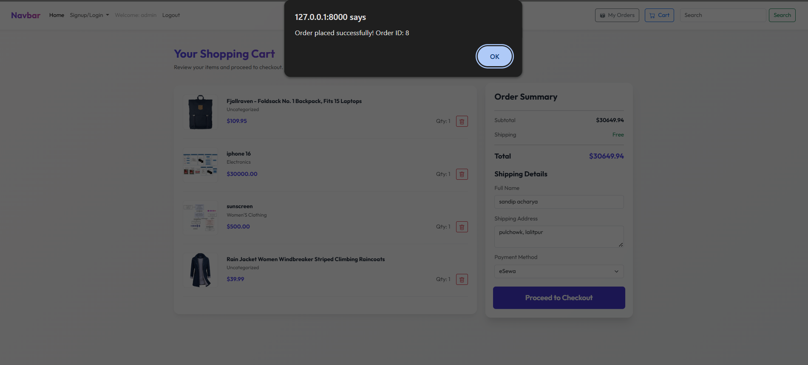
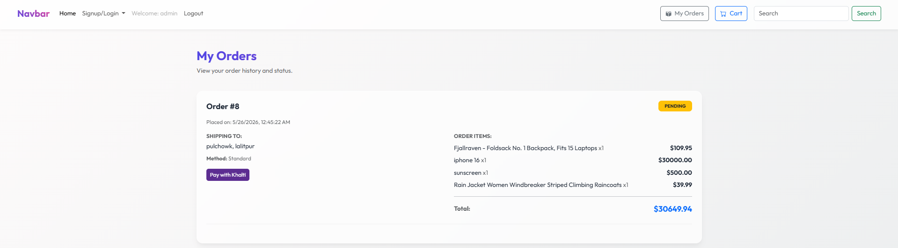
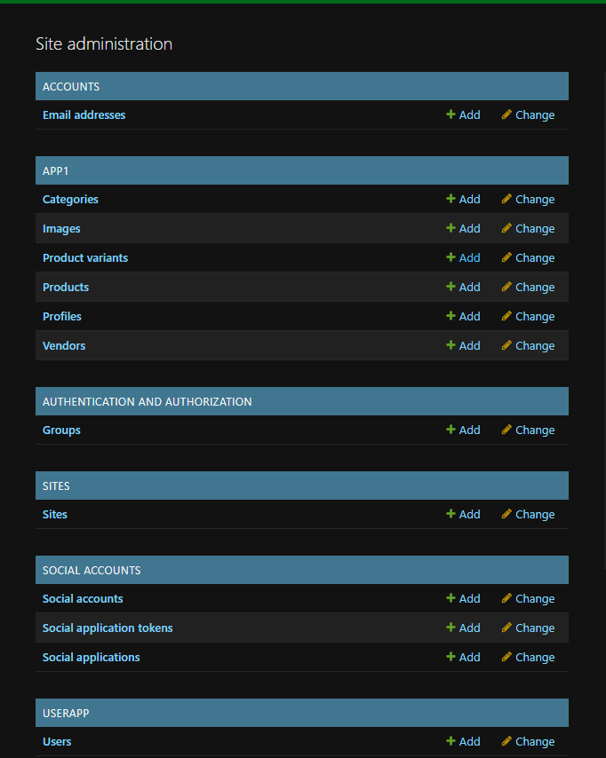

## 📸 Application Screenshots

The following screenshots demonstrate the full user journey through every role in the platform.

### 1. Guest View — Homepage (Unauthenticated)
> A visitor can browse all available products without being logged in. The Cart and My Orders buttons are hidden from the navbar, enforcing authentication boundaries.

---

### 2. Become a Vendor
> Any registered customer can upgrade to a Vendor account by providing their store name and description. This is handled by our dedicated `become_vendor` view, which atomically sets `is_vendor=True` and creates a linked `Vendor` profile.

---

### 3. Vendor Dashboard — Product Listing
> The Vendor Dashboard shows a fully secure, data-table of all products belonging to **only** the currently logged-in vendor. The query is filtered server-side using `Product.objects.filter(vendor=request.user.vendor)`.

---

### 4. Update Product — Pre-filled Edit Form
> Clicking "Edit" on any product opens a pre-filled form backed by `ProductForm(instance=product)`. A `get_object_or_404` guard ensures a vendor can **never** edit another vendor's products via URL manipulation.

---

### 5. Order Placement — My Orders View
> After checkout, all orders are displayed in the "My Orders" page. Each order card shows its status badge, shipping details, itemized list, and the total amount. Pending orders show a **Pay with Khalti** button.

---

### 6. Payment Gateway — Khalti Integration
> Clicking "Pay with Khalti" triggers the Khalti SDK flow. Upon user confirmation, the frontend sends a cryptographic token to our DRF endpoint `/api/orders/{id}/verify_khalti/`, which performs server-to-server validation and updates the order status to `processing`.

---

### 7. Administrator Panel
> The Django Admin panel provides superusers with full CRUD access over all registered models: Categories, Products, Variants, Vendors, Profiles, Carts, Orders, and Users — all managed through the custom `CustomerUser` model.

